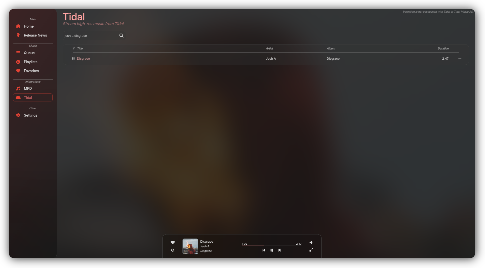
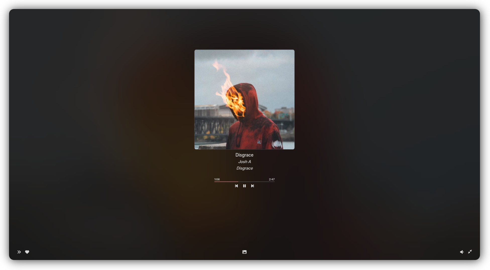

## Vermilion

Vermilion is a clean, minimal and simple music player for MPD, Tidal, Spotify and more.

> [!NOTE]
> Please note Vermilion is in very early stages of development.
> Bugs are to be expected.

  

## Features

- Play queue
- Mini / fullscreen player with controls and lyrics
- Tidal / MPD / Spotify / YT Music support
- Listenbrainz integration
- MPRIS integration
- Discord RPC integration

### Planned

- favorites (fetch / send)
- local playlists
- a bunch of qol stuff

## Integrations

### MPD

Go to settings and input your mpd server's address and port. That's it.

#### Supported

- Playback
- Volume
- Searching for songs

#### Planned

- Searching for albums / artists
- Browsing artist / album pages

### Tidal

> [!NOTE]
> Tidal playback is supported via widevine and a custom electron version from [castlabs](https://github.com/castlabs/electron-releases).
> This does mean that Digital Rights Management is used to play Tidal content.
>
> Please also do note that Vermilion is not designed to bypass any of Tidal's content restrictions. You will need a paid account to use Tidal within Vermilion, and will be shown your account region's content offering, just like in the official app.

Check the [docs](./docs/Tidal.md) for how to connect Vermilion to Tidal.

#### Supported

- Playback
- Volume
- Playlists (read, remove, add)
- Searching for songs / albums / artists
- Browsing artist / album pages
- Video album covers
- Lyrics

#### Planned

- Adding / editing playlists
- Viewing / adding / removing favorites

### Spotify

> [!NOTE]
> Spotify playback requires a Spotify Premium account to work, and a small API setup.
>
> Check the [docs](./docs/Spotify.md) for more.

#### Supported
- Playback
- Volume
- Searching for songs / albums / artists
- Browsing artist / album pages
- Browsing your playlists

#### Planned

- Adding / editing playlists
- Viewing / adding / removing favorites

### YT Music

> [!NOTE]
> YT Music playback is quite barebones and has quite serious caveats. It is also very much unofficial.
>
> Check the [docs](./docs/YTM.md) for more.

#### Supported

- Playback
- Volume
- Searching for songs

#### Planned

- Artist and album pages
- Workaround for IP blocks
- Playlists

## Building

See [building.md](./docs/Building.md).

## Disclaimer

Vermilion is in no way associated with, or endorsed by, Tidal, TIDAL Music AS, Youtube, Spotify, Youtube Music or Google LLC.
