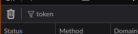
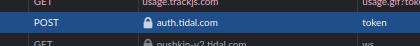
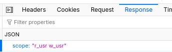

## Tidal integration

The Tidal integration is _not_ official. Vermilion essentially uses _private Tidal APIs_ just like the Tidal web app or the desktop app.

Can it be detected? Definitely.

Will you be banned? Very unlikely, but I can't promise anything.

## How to connect Vermilion to Tidal

> [!IMPORTANT]
> Vermilion runs off of your user token + id. ***DO NOT*** share them with anyone, even if they ask very nicely, as it grants anyone with them full access to your account.

To get your token:

- Log into [listen.tidal.com](https://listen.tidal.com). 
- Turn on developer tools (`F12`) and go to the _Network_ tab.
- Type `token` into the filter bar: 
  
- Refresh the page.
- Grab a request that has the resource of just `token`: 
  
- Click it and go to the `response` tab: 
  
  
- Copy the `client_id` value and paste it into the `Tidal Client ID` setting.
- Copy the `refresh_token` value and paste it into the `Tidal Token` setting.
- You're done! Close the tidal web player (_do not_ log out!), restart Vermilion and you can listen to music from Tidal.
